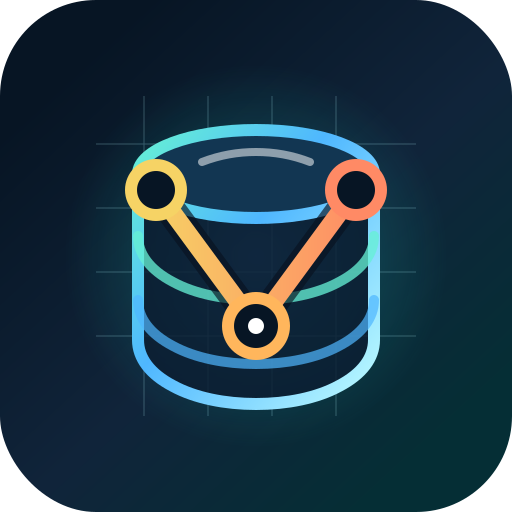

<p align="center">
  
</p>

<h1 align="center">Vexra</h1>

<p align="center">
  <strong>面向向量的 SQLite</strong><br>
  一个嵌入式、单文件的向量数据库，适合本地 AI 应用、RAG 原型和边缘服务。
</p>

<p align="center">
  <a href="README.md"><strong>简体中文</strong></a>
  ·
  <a href="README.en.md">English</a>
</p>

<p align="center">
  <a href="https://github.com/Mengxun326/Vexra/actions/workflows/ci.yml"></a>
  <a href="https://crates.io/crates/vexra-cli"></a>
  <a href="https://www.npmjs.com/package/@mengxun326/vexra"></a>
  <a href="https://pypi.org/project/vexra/"></a>
  <a href="https://github.com/Mengxun326/Vexra/pkgs/container/vexra"></a>
  <a href="https://github.com/Mengxun326/Vexra/blob/master/LICENSE"></a>
  
  
</p>

Vexra 是一个 Rust 原生的嵌入式向量数据库。它运行在应用进程内，将向量和元数据持久化到本地数据库文件，并通过同一套核心引擎提供 Rust API、命令行工具、HTTP 服务、Python 绑定、JavaScript 绑定和 C FFI。

当你希望获得向量检索能力，又不想部署独立数据库服务时，Vexra 会很合适：本地优先的 AI 工具、桌面应用、测试夹具、小型 RAG 系统、端侧语义搜索，以及“一份二进制 + 一个数据文件”更容易交付的边缘场景。

## 特性

| 能力 | 说明 |
| --- | --- |
| 嵌入式部署 | 直接链接 Rust crate、使用 CLI，或启动内置 HTTP 服务；不需要额外守护进程。 |
| 单文件持久化 | Collection、向量、元数据和 catalog 状态都保存在 Vexra 数据库文件中。 |
| WAL 恢复 | 通过预写日志和 checkpoint 机制保护写入，降低进程重启后的数据风险。 |
| 向量索引 | Flat 精确检索适合小集合；HNSW 近似最近邻检索适合更大规模。 |
| 距离度量 | 支持 Cosine、Euclidean 和 dot product。 |
| 元数据过滤 | 存储 JSON 元数据，并用 `kind = "note" AND score > 0.8` 这样的表达式过滤搜索结果。 |
| 混合检索模块 | Workspace 包含简单 embedding、BM25 稀疏检索和 RRF 融合等构建模块。 |
| SIMD 距离内核 | 距离计算包含标量 fallback，并在可用平台上使用 AVX2 和 NEON 路径。 |
| 多语言接口 | Rust、CLI、HTTP、Python、JavaScript 和 C ABI 都复用同一个核心引擎。 |
| Dashboard | `vexra serve` 可启动本地管理界面和 REST API。 |

## 快速开始

**从包管理器安装：**

```bash
cargo install vexra-cli        # Rust / crates.io
pip install vexra               # Python / PyPI
npm install @mengxun326/vexra   # Node.js / npm
docker pull ghcr.io/mengxun326/vexra:v1.3.1  # Docker
```

**Docker 一行启动：**

```bash
docker run -p 9020:9020 -v ./data:/data ghcr.io/mengxun326/vexra:v1.3.1
```

**从源码安装 CLI：**

```bash
git clone https://github.com/Mengxun326/Vexra.git
cd Vexra
cargo install --path crates/vexra-cli
```

创建数据库、创建 collection、插入向量并搜索：

```bash
vexra --path data.vexra init
vexra --path data.vexra create-collection --name docs --dim 4 --distance cosine --index hnsw

vexra --path data.vexra insert \
  --collection docs \
  --id doc-1 \
  --vector 0.12,0.24,0.36,0.48 \
  --meta '{"kind":"note","title":"hello vectors"}'

vexra --path data.vexra search \
  --collection docs \
  --vector 0.10,0.20,0.30,0.40 \
  --top-k 5 \
  --format json
```

启动本地 API 和 Dashboard：

```bash
vexra --path data.vexra serve --host 127.0.0.1 --port 9020
```

然后打开 `http://127.0.0.1:9020`。

## Rust API

```rust
use serde_json::json;
use vexra_core::{
    CollectionConfig, Database, DistanceMetric, Document, SearchQuery,
};

fn main() -> vexra_core::Result<()> {
    let db = Database::open("data.vexra")?;

    if !db.collection_exists("docs") {
        let mut config = CollectionConfig::new("docs", 4)
            .with_distance(DistanceMetric::Cosine)
            .with_description("Example documents");
        config.index_type = "hnsw".to_string();
        db.create_collection(config)?;
    }

    vexra_core::insert(
        &db,
        "docs",
        Document::with_vector_and_metadata(
            "doc-1",
            vec![0.12, 0.24, 0.36, 0.48],
            json!({"kind": "note", "title": "hello vectors"}),
        ),
    )?;

    let hits = vexra_core::search(
        &db,
        "docs",
        SearchQuery::with_vector(vec![0.10, 0.20, 0.30, 0.40], 5)
            .with_filter(r#"kind = "note""#),
    )?;

    for hit in hits {
        println!("{} {}", hit.id, hit.score);
    }

    db.close()?;
    Ok(())
}
```

## Python API

Python 包名为 `vexra`：

```bash
pip install vexra
```

```python
import vexra

db = vexra.Database("data.vexra")
col = db.create_collection("docs", 4, "cosine")

col.insert([0.12, 0.24, 0.36, 0.48], id="doc-1")
results = col.search([0.10, 0.20, 0.30, 0.40], top_k=5)

for hit in results:
    print(hit["id"], hit["score"])

db.close()
```

## HTTP API

启动服务：

```bash
vexra --path data.vexra serve --port 9020
```

创建 collection：

```bash
curl -X POST http://127.0.0.1:9020/api/collections \
  -H "content-type: application/json" \
  -d '{"name":"docs","dimension":4,"distance":"cosine"}'
```

插入文档：

```bash
curl -X POST http://127.0.0.1:9020/api/collections/docs/documents \
  -H "content-type: application/json" \
  -d '{"id":"doc-1","vector":[0.12,0.24,0.36,0.48],"metadata":{"kind":"note"}}'
```

搜索：

```bash
curl -X POST http://127.0.0.1:9020/api/collections/docs/search \
  -H "content-type: application/json" \
  -d '{"vector":[0.10,0.20,0.30,0.40],"top_k":5,"filter":"kind = \"note\""}'
```

## 架构

```text
Applications
  |-- Rust API
  |-- CLI
  |-- HTTP + Dashboard
  |-- Python SDK
  |-- JavaScript SDK
  `-- C FFI
        |
        v
vexra-core
  |-- collection catalog
  |-- document API
  |-- metadata filtering
  `-- search orchestration
        |
        +-- vexra-storage   pages, database header, WAL, cache
        +-- vexra-index     Flat, HNSW, distance metrics, SIMD kernels
        +-- vexra-metadata  JSON metadata store and filter parser
        +-- vexra-query     BM25 and rank fusion primitives
        `-- vexra-embedding simple local text embedding utilities
```

## Workspace 结构

| 路径 | 作用 |
| --- | --- |
| `crates/vexra-core` | 公共 Rust API、数据库句柄、collection 和文档操作。 |
| `crates/vexra-storage` | 基于 page 的存储引擎、数据库格式、page cache 和 WAL。 |
| `crates/vexra-index` | Flat/HNSW 向量索引和距离计算内核。 |
| `crates/vexra-metadata` | JSON 元数据存储和过滤表达式。 |
| `crates/vexra-query` | BM25 稀疏检索和融合工具。 |
| `crates/vexra-embedding` | 轻量级本地 embedding 工具。 |
| `crates/vexra-cli` | `vexra` 命令行工具。 |
| `crates/vexra-server` | Axum REST API 和内置 Dashboard。 |
| `crates/vexra-ffi` | 面向其他运行时集成的 C ABI。 |
| `sdk/python` | 基于 PyO3 的 Python 包。 |
| `sdk/javascript` | 基于 napi-rs 的 Node.js 包。 |

## 项目状态

Vexra 目前处于早期 release candidate 阶段。核心存储、collection、向量检索、CLI、Python 绑定和 HTTP API 已可使用，但稳定 1.x 之前 API 仍可能调整。用于生产工作负载前，请使用自己的数据做基准测试、保留备份，并固定具体版本。

近期重点：

- 将所有包元数据、文档和 SDK 示例统一到 Vexra 命名。
- 扩展元数据过滤、HNSW 调优和混合检索示例。
- 改进 storage compaction 和长时间写入场景。
- 发布更完整的 Flat 与 HNSW 检索行为基准测试。

## 品牌资产

Vexra 图标位于 [`assets/vexra-logo.svg`](assets/vexra-logo.svg)。它融合了数据库圆柱、向量节点和 V 形搜索路径，在较小尺寸下也能保持清晰识别。

## 贡献

欢迎贡献。提交 pull request 前请阅读 [`CONTRIBUTING.md`](CONTRIBUTING.md)，bug 报告、功能请求和设计讨论可以通过 GitHub Issues 发起。

## 许可证

Vexra 使用 [MIT License](LICENSE) 发布。
